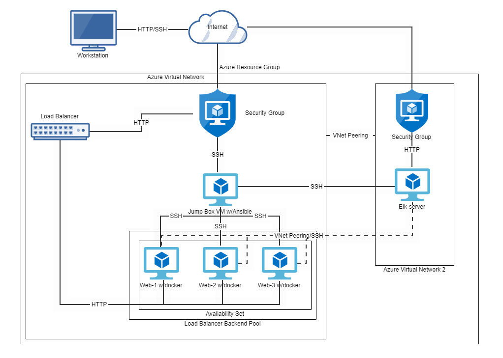
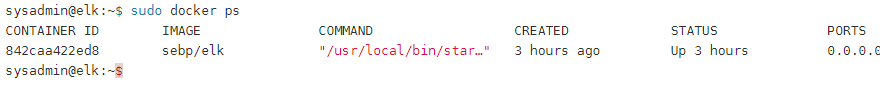

## Automated ELK Stack Deployment

The files in this repository were used to configure the network depicted below.

These files have been tested and used to generate a live ELK deployment on Azure. They can be used to either recreate the entire deployment pictured above. Alternatively, select portions of the playbook file may be used to install only certain pieces of it, such as Filebeat.

This document contains the following details:
- Description of the Topology
- Access Policies
- ELK Configuration
  - Beats in Use
  - Machines Being Monitored
- How to Use the Ansible Build

### Description of the Topology

The main purpose of this network is to expose a load-balanced and monitored instance of DVWA, the D*mn Vulnerable Web Application.

Load balancing ensures that the application will be highly efficient, in addition to restricting traffic to the network.
- Load balancing also helps to protect against distributed denial-of-service (DDoS) attacks.
- Having a jump box is a highly secure way to allow administrative access to your network to perform tasks.

Integrating an ELK server allows users to easily monitor the vulnerable VMs for changes to the server and system log data.
- Filebeat collects data about the file system.
- Metricbeat collects machine metrics.

The configuration details of each machine may be found below.
_Note: Use the [Markdown Table Generator](http://www.tablesgenerator.com/markdown_tables) to add/remove values from the table_.

| Name       | Function   | IP Address | Operating System |
|------------|------------|------------|------------------|
| Jump Box   | Gateway    | 10.0.0.1   | Linux            |
| Web-1      | backend    | 10.0.0.5   | Linux            |
| Web-2      | backend    | 10.0.0.7   | Linux            |
| Web-3      | backend    | 10.0.0.8   | Linux            |
| Elk-server | Monitoring | 10.1.0.4   | Linux            |
### Access Policies

The machines on the internal network are not exposed to the public Internet. 

Only the jump box machine can accept connections from the Internet. Access to this machine is only allowed from the following IP addresses:
- [ your personal IP address]

Machines within the network can only be accessed by SSH.
- The jumpbox is allowed to access the ELK VM.
 - The IP used 168.62.163.62 

A summary of the access policies in place can be found in the table below.

| Name       | Publicly Accessible | Allowed IP Addresses |
|------------|---------------------|----------------------|
| Jump Box   | Yes                 |   [your IP address]  |
| Web-1      | No                  | 168.62.163.62        |
| Web-2      | No                  | 168.62.163.62        |
| Web-3      | No                  | 168.62.163.62        |
| Elk-server | Yes                 | 40.77.25.211         |

### Elk Configuration

Ansible was used to automate configuration of the ELK machine. No configuration was performed manually, which is advantageous because...
- Performing these tasks on multiple servers multiple times is taxing and time consuming. Having the advantage of being able to automate these processes inhances a cloud developers configuration mangement skills allowing them to handle more servers and applications while addressing these complicated tasks.

The playbook implements the following tasks:
- Install docker.io
- Install pip3
- Install Docker python module
- Increase memory
- Download and launch a docker elk container

The following displays the result of running `docker ps` after successfully configuring the ELK instance.

### Target Machines & Beats
This ELK server is configured to monitor the following machines:
- Web-1 10.0.0.5
- Web-2 10.0.0.7
- Web-3 10.0.0.8

We have installed the following Beats on these machines:
- Filebeat
- Metricbeat

These Beats allow us to collect the following information from each machine:
- Filebeat collects data pertaining to file systems, such as /etc/passwd, or syslog.
- Metricbeat collects data that pertains to machine metrics such as CPU usage, and machine uptime. 

### Using the Playbook
In order to use the playbook, you will need to have an Ansible control node already configured. Assuming you have such a control node provisioned: 

SSH into the control node and follow the steps below:
- Copy the install-elk.yml file to /etc/ansible/.
- Update the hosts file to include the IP for your Elk-server 10.1.0.4
- Run the playbook, and navigate to elk-docker container to check that the installation worked as expected.
- run this command <<ansible-playbook /etc/ansible/install-elk.yml>> to download the playbook
- verify you can load the ELK stack server from your browser at http://40.77.25.211:5601/app/kibana.